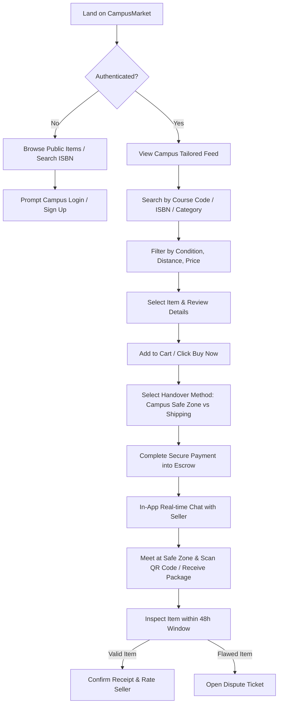
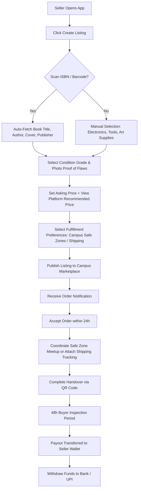
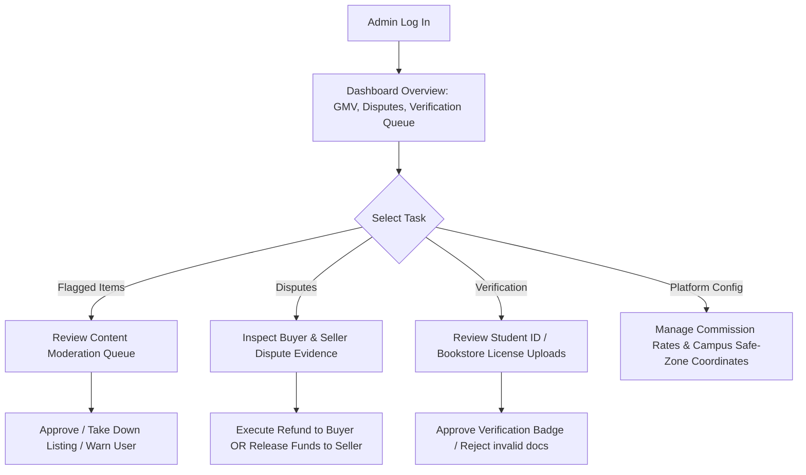

# CampusMarket (Student Secondhand Marketplace)
## Complete Product Architecture Specification

---

## 1. Product Vision
**CampusMarket** is a hyper-localized, trust-first peer-to-peer (P2P) and commercial secondhand marketplace specifically engineered for higher education environments. The platform bridges individual students and local secondhand bookstores with student buyers to facilitate the buying, selling, and trading of academic essentials (textbooks, lab gear, scientific calculators, musical instruments, art supplies, and educational electronics).

By leveraging campus `.edu` verification, course-matched search, ISBN metadata auto-population, and designated safe campus handover zones, CampusMarket eliminates predatory bookstore buyback rates, unsafe off-campus meetups, vague item condition descriptions, and off-platform fraud.

---

## 2. Target Users
1. **Primary Buyers (Students)**:
   - Undergraduate and graduate students seeking affordable course materials, tools, and electronics.
   - Incoming freshmen looking for cost-effective starter gear (drafting boards, lab coats, calculators).
   - Research assistants and budget-conscious student researchers.
2. **Primary Individual Sellers (Students)**:
   - Graduating or continuing students offloading past course textbooks, lab equipment, drawing kits, and electronics.
   - Student organization representatives clearing donated or leftover event/academic materials.
3. **Commercial Sellers (Secondhand Bookstores & Campus Buyback Vendors)**:
   - Local off-campus secondhand bookstores seeking direct digital access to the campus student body.
   - Campus textbook buyback operators seeking digital catalog reach.
4. **Platform Administrators & Operations Personnel**:
   - Operations managers, trust & safety officers, customer support representatives, and campus student ambassadors.

---

## 3. Core Value Proposition
* **For Student Buyers**:
  * **Massive Cost Savings**: 40–70% lower prices compared to new campus retail or publisher prices.
  * **Campus Proximity**: Same-day in-person handover at verified campus safe zones (no long shipping waits).
  * **Course Relevance**: Ability to search directly by course code (e.g., `CS101`, `CHEM201`) to find exact required editions.
  * **Guaranteed Condition Trust**: Escrow-backed payments hold funds until the buyer verifies item condition upon receipt.
* **For Student Sellers**:
  * **Higher Payouts**: Earn significantly more than predatory 10–20% campus bookstore buyback rates.
  * **Zero-Friction Listing**: Instant metadata population via ISBN barcode scanning.
  * **Hyper-Local Buyers**: Fast sales cycles driven by peer demand within the same college campus.
* **For Secondhand Bookstores**:
  * **Direct Campus Reach**: Access to hyper-targeted local campus demographics without building proprietary apps.
  * **Bulk Inventory Tools**: Batch CSV upload and inventory synchronization.
* **For Educational Institutions**:
  * **Circular Campus Economy**: Promotes sustainability and reduces environmental waste while easing student financial strain.

---

## 4. User Roles & Permissions Matrix

| Capability / Action | Guest (Unverified) | Student Buyer | Student Seller | Commercial Bookstore | Platform Admin |
| :--- | :---: | :---: | :---: | :---: | :---: |
| Browse public catalog & search items | Read | Read | Read | Read | Full |
| View seller profiles & aggregated ratings | Read | Read | Read | Read | Full |
| Search by Course Code & ISBN | Read | Read | Read | Read | Full |
| Add items to Wishlist / Cart | ❌ | Read / Write | Read / Write | Read / Write | Full |
| Direct Message / Chat with Sellers | ❌ | Allowed | Allowed | Allowed | View / Moderate |
| Place Orders & Submit Escrow Payments | ❌ | Allowed | Allowed | Allowed | Refund / Cancel |
| Create & Manage Item Listings | ❌ | ❌ | Own Only | Own Only (Bulk) | Full (Moderate) |
| Accept / Reject Purchase Offers | ❌ | ❌ | Own Only | Own Only | Override |
| Access Bookstore Analytics Dashboard | ❌ | ❌ | ❌ | Store Only | Aggregate |
| Moderation, Dispute Resolution & Payout Triggers | ❌ | ❌ | ❌ | ❌ | Full Admin Access |

---

## 5. Core Marketplace Workflows

### A. Discovery to Order Flow
1. **Search/Browse**: Buyer enters query (Keyword, ISBN, Title, Course Code, or Category) and filters by Campus, Condition, and Price range.
2. **Item Evaluation**: Buyer reviews photos, seller rating, condition grade, included accessories, and pickup/shipping terms.
3. **Order Placement**: Buyer selects handover mode (Campus Meetup Point or Shipping) and places an order.
4. **Escrow Authorization**: Funds are authorized and charged into an escrow hold account.
5. **Seller Notification & Acceptance**: Seller receives alert and has 24 hours to accept the order.
6. **Fulfillment**:
   * *Campus Handover*: Both parties select an official Campus Safe Zone and time window. Verification OTP/QR code exchanged at handover.
   * *Shipping*: Seller prints pre-generated shipping label and drops off package.
7. **Inspection Window**: Buyer has a 48-hour inspection window post-delivery/handover to verify condition.
8. **Completion & Release**: Buyer confirms receipt (or timer expires cleanly) -> Escrow releases funds to seller wallet.

### B. Dispute & Refund Workflow
1. **Dispute Initiated**: Buyer flags issue within the 48-hour window (e.g., missing pages, wrong edition, broken calculator screen).
2. **Escrow Lock**: Payout to seller is immediately frozen.
3. **Evidence Submission**: Buyer uploads photos/video proof; seller provides response within 24 hours.
4. **Admin Moderation**: Support agent reviews chat logs, item photos at listing time vs dispute proof.
5. **Resolution**:
   * *Buyer Favored*: Full refund issued to buyer; seller receives returning shipping label or return instructions.
   * *Seller Favored*: Escrow funds released to seller; dispute closed.

### C. Campus Verification Workflow
1. **Initiation**: User signs up with standard email or SSO.
2. **Campus Selection**: User picks primary university/college campus.
3. **Verification Method**: User inputs `.edu` campus email or uploads Student ID card photo.
4. **Verification Validation**: Automated OTP sent to campus email OR manual admin check for ID upload.
5. **Badge Assignment**: User profile unlocked with "Verified Campus Student" badge.

---

## 6. Buyer Journey Map



---

## 7. Seller Journey Map



---

## 8. Admin Journey Map



---

## 9. Major Platform Modules

1. **Authentication & Identity Service**:
   * Multi-role JWT/SSO auth, `.edu` email domain parser, OTP verification, Student ID document analyzer.
2. **Catalog & Search Engine**:
   * Multi-faceted elastic search index supporting full-text search, ISBN-10/13 lookup, course code taxonomies, and spatial geo-distance filtering.
3. **Listing & Inventory Management Module**:
   * Photo upload handler with WebP compression, prefilled metadata engine (integration with Open Library / Google Books APIs), condition tagging system.
4. **Order & Escrow State Machine**:
   * Manages order lifecycle (`Created` -> `Paid/Escrow` -> `Accepted` -> `In-Transit/Handover-Pending` -> `Delivered` -> `Completed` / `Disputed`).
5. **Campus Safe-Zone & Logistics Engine**:
   * Geo-fenced campus safe handover points database (e.g. Student Union, Main Library), delivery tracking integrations.
6. **Messaging & Notification Microservice**:
   * WebSockets/Socket.io real-time chat, transactional push/SMS/email notifications, regex-based PII masking engine (detects raw phone numbers/external links).
7. **Reputation & Review System**:
   * Double-blind mutual review processing, trust badge algorithm, score calculation.
8. **Dispute & Moderation Module**:
   * Evidence upload bucket, support ticketing workflow, partial/full refund triggers.
9. **Payout & Financial Ledger**:
   * Split payment handling (Stripe Connect / Razorpay Route), seller wallet ledger, direct bank payout processor, admin commission collection.

---

## 10. Prioritized Feature Roadmap (MVP vs V2 vs Future)

### A. MUST HAVE (MVP Launch Critical)
* **User & Campus Auth**:
  * Email/Password sign up with mandatory `.edu` campus email validation for student badge.
  * Basic user profile (Name, Campus, Profile picture, Ratings).
* **Listing Creation & Catalog**:
  * Manual listing creation for all 10 product categories.
  * Up to 4 uploaded images per listing.
  * Standard condition taxonomy (`Brand New`, `Like New`, `Good`, `Fair`, `Acceptable`).
  * Price & item description fields.
* **Search & Discovery**:
  * Search bar (Keyword, Title, ISBN, Course Code).
  * Category dropdown & Campus selector.
  * Basic sort (Price Low-to-High, High-to-Low, Newest First).
* **Transaction & Payment**:
  * Direct payment gateway integration (Stripe / Razorpay).
  * In-platform Escrow engine (holds seller payout until 48 hours post-delivery).
  * Handover choice: Campus Safe Zone Meetup OR Standard Shipping.
* **Communication & Fulfillment**:
  * In-app real-time buyer-seller messaging for coordinating handover.
  * Simple 6-digit OTP / QR code exchange for in-person handover verification.
* **Admin Capabilities**:
  * Basic moderation dashboard (delete listing, ban user, manual refund trigger).

### B. SHOULD HAVE (Immediate Post-MVP / High Value)
* **ISBN Barcode Auto-Fill**:
  * Camera-based ISBN barcode scanner in browser/app to auto-populate Title, Author, Publisher, Cover Image via Open Library API.
* **Course Code Indexing**:
  * Campus-specific course catalog linking (e.g. associating textbooks with `MATH-201`).
* **Saved Items & Wishlists**:
  * Ability to bookmark items and receive price-drop notifications.
* **Double-Blind Reviews**:
  * Buyer and seller can only see each other's review after both submit or after 7 days.
* **Smart Price Helper**:
  * Recommends listing price based on historical sales data of similar items/conditions.

### C. LATER (V2 / Scale Expansion)
* **Bookstore Commercial Portal**:
  * Multi-quantity inventory management, CSV batch upload, custom physical store operating hours & pickup counter instructions.
* **AI Visual Condition Grading**:
  * Computer vision inspection of uploaded photos to detect page highlighting, spine damage, or calculator screen cracks.
* **Campus Smart Locker Integration**:
  * Automated 24/7 contactless drop-off and pick-up via campus locker hardware.
* **Peer-to-Peer Semester Rentals**:
  * Support for textbook rentals with automated security deposit retention for unreturned/damaged rentals.
* **Guaranteed Buyback Program**:
  * Instant platform buyback quotes at semester end.

---

## 11. V2 Features (Detailed Specification)
1. **ISBN Mobile Web Barcode Scanning**:
   * WebRTC/HTML5 camera integration for instant barcode scanning directly on the web app without app installation.
2. **Course Syllabus Import & Mapping**:
   * Crowd-sourced or admin-imported course reading lists allows students to click "My Courses" and immediately view all secondhand materials available on campus for their enrolled classes.
3. **Bookstore Retail Dashboard**:
   * Dedicated merchant backend allowing local bookstore owners to manage catalog, print pick-lists, view store revenue, and run storewide clearance sales.
4. **Automated Dynamic Pricing Engine**:
   * Analyzes current supply vs demand (e.g., spike in demand during August/September) and suggests optimal price bounds for sellers to achieve high liquidity.

---

## 12. Future Features (Long-Term Vision)
1. **AI Product Condition Audit**:
   * Deep learning model flags discrepancies between seller marked condition ("Like New") and image pixels showing heavily highlighted pages or worn edges.
2. **Smart Campus Locker Logistics**:
   * Partners with university campus mailrooms or smart locker providers (e.g., Luxer One) for zero-contact drop-offs.
3. **Student-to-Student Rental Engine**:
   * Deposit-backed rental locks where buyers pay a small fee per semester; deposit is refunded upon semester return.

---

## 13. Important Edge Cases & Handling Mechanisms

| Edge Case Scenario | Risk Level | Platform Handling Mechanism |
| :--- | :---: | :--- |
| **No-Show during Campus Safe Zone Meetup** | Medium | 15-minute grace period. If a party fails to show up, the non-fault party flags "No Show". Repeat seller no-shows deduct trust score; buyer no-shows cancel order with a small inconvenience fee charged. |
| **Misrepresented Item Condition** (e.g., calculator missing back cover, textbook missing required access code) | High | Escrow hold prevents auto-payout. Buyer submits photo proof within 48h. Admin triggers partial refund (if buyer keeps item) or full refund (upon return). |
| **Off-Platform Circumvention** (User shares phone/Venmo in chat to avoid fee) | High | Automated regex filter intercepts phone numbers, external URLs, Zelle/Venmo tags. System masks message and issues warning banner: *"Off-platform payments lose Escrow protection."* |
| **Prohibited / Counterfeit / Pirated Material** (Selling PDF prints or stolen campus equipment) | High | Keyword blocker for "PDF", "test bank", "cheatsheet". Automated barcode check against known commercial databases. Instant listing suppression upon 2 user flags. |
| **Unresponsive Buyer Post-Delivery** (Buyer receives package via courier but forgets to click 'Confirm Receipt') | Low | Automated 72-hour timer post carrier delivery confirmation. If no dispute is raised, system auto-completes order and releases funds to seller. |

---

## 14. Trust and Safety Requirements

1. **Identity & Verification Layer**:
   * Mandatory `.edu` domain verification or Student ID document upload to display the "Campus Verified Student" badge.
   * Commercial sellers must submit business registration and physical store location proof.
2. **Escrow Financial Security**:
   * 100% of payments held in secure escrow accounts until buyer confirmation or 48h dispute timer expiration.
3. **Campus Safe-Zone Registry**:
   * Pre-selected, high-visibility, camera-monitored campus locations (Main Library entrance, Student Union info desk, Campus Police foyer) mandated for all in-person handovers.
4. **Chat Protection & Privacy**:
   * Real-time regex detection masking email addresses, phone numbers, and payment app tags.
   * User phone numbers and real email addresses are NEVER disclosed to counterparties.
5. **Double-Blind Reputation Mechanics**:
   * Reviews published simultaneously after both parties rate each other, preventing retaliatory negative reviews.

---

## 15. Marketplace Rules & Policy Governance

1. **Condition Transparency Rule**:
   * Sellers must explicitly state and upload photos of any page highlighting, writing, binding damage, missing access codes, or cosmetic defects.
2. **Prohibited Items Policy**:
   * Strictly banned: Stolen university property, stolen lab equipment, copyrighted PDF prints, instructor solution manuals, live exam papers, non-educational items (clothing, furniture, general electronics).
3. **Fair Pricing & Anti-Scalping Policy**:
   * Secondhand listings may not exceed the official manufacturer's retail price (MSRP) for active educational materials.
4. **Fulfillment Timelines**:
   * Sellers must accept orders within **24 hours** and complete handover/shipping drop-off within **48 hours** of acceptance. Unfulfilled orders auto-cancel with seller penalty.

---

## 16. Recommended Technology Architecture

```
                                  +-------------------------------------------------------+
                                  |              Client Applications                      |
                                  |  Next.js PWA (Web/Mobile) / Tailwind CSS / WebRTC     |
                                  +---------------------------+---------------------------+
                                                              |
                                                              v
                                  +-------------------------------------------------------+
                                  |                 API Gateway & Auth                    |
                                  |          NestJS REST / GraphQL / JWT / Auth0          |
                                  +---------------------------+---------------------------+
                                                              |
               +----------------------+-----------------------+-----------------------+
               |                      |                       |                       |
               v                      v                       v                       v
    +--------------------+  +-------------------+   +--------------------+  +-------------------+
    | User & Identity    |  | Catalog & Search  |   | Order & Escrow     |  | Messaging & Chat  |
    | Microservice       |  | (Meilisearch)     |   | State Machine      |  | (WebSockets)      |
    +---------+----------+  +---------+---------+   +---------+----------+  +---------+---------+
              |                       |                       |                       |
              +-----------------------+-----------+-----------+-----------------------+
                                                  |
                                                  v
                               +-------------------------------------+
                               |           Data Persistence          |
                               |  MySQL 8.0+ (Primary Relational)    |
                               |  Redis (Session / Queue / Caching)  |
                               |  AWS S3 / Cloudflare R2 (Images)    |
                               +-------------------------------------+
```

* **Frontend**: Next.js 14+ (App Router), Tailwind CSS, TypeScript, WebRTC Camera Barcode Scanner.
* **Backend API**: Node.js with NestJS (Modular Monolith architecture for fast MVP, easily decoupled into microservices later).
* **Database**: MySQL 8.0+ (Primary ACID relational database for Users, Listings, Orders, Escrow Ledger) + Redis (Session storage, API rate limiting, real-time message queuing).
* **Search Engine**: Meilisearch or Elasticsearch for sub-50ms full-text and faceted ISBN/Course Code searching.
* **Object Storage & CDN**: Cloudflare R2 / AWS S3 with image optimization pipelines (WebP conversion, auto-thumbnail generation).
* **Payment Processor**: Stripe Connect / Razorpay Route (native escrow hold, split fee structure, direct connected account payouts).

---

## 17. Scalability & Operational Considerations

1. **Campus Multi-Tenancy Architecture**:
   * Logical partitioning of listings by `campus_id` ensures low index sizes and ultra-fast queries for students searching within their specific university.
2. **Read-Heavy Query Optimization**:
   * 90%+ of traffic is catalog browsing. Redis caching layer caches top course catalogs, home feed listings, and search facets.
3. **Asynchronous Background Processing**:
   * Heavy tasks (ISBN metadata hydration, transactional emails, push notifications, image compression) offloaded to background worker queues (BullMQ).
4. **Media CDN Distribution**:
   * User uploaded listing photos are compressed at edge to WebP format, reducing bandwidth usage on campus Wi-Fi / cellular data.

---

## 18. Business Model & Monetization Strategy

1. **Buyer / Seller Transaction Fee (Primary)**:
   * **5% - 8% Platform Take Rate** per completed transaction deducted from seller payout upon escrow release.
2. **Commercial Bookstore Subscription (Secondary)**:
   * **$29 - $99 / month** tier for secondhand bookstores providing bulk inventory sync, store branding, and lower transaction fees (3%).
3. **Featured Listing Promotions (Micro-transactions)**:
   * **$0.99 - $1.99** one-time fee for student sellers to feature their listing at the top of high-traffic course code search results during exam seasons.
4. **Campus Brand Partnerships**:
   * Sponsored placement for student services (e.g. housing platforms, student banking, online tutoring services).

---

## 19. Key Metrics & Key Performance Indicators (KPIs)

* **Financial Metrics**:
  * **GMV (Gross Merchandise Value)**: Total volume of merchandise transactions per semester.
  * **Net Take Rate Revenue**: Net platform revenue after payment gateway processing fees.
* **Marketplace Health Metrics**:
  * **Liquidity Rate**: Percentage of published listings sold within 14 days.
  * **Time-to-Sell**: Average number of days between listing creation and order acceptance.
  * **Dispute Rate**: Percentage of total orders resulting in a formal dispute (Target: `< 1.5%`).
* **User Engagement Metrics**:
  * **Campus Penetration Rate**: Ratio of active verified `.edu` users relative to total enrolled students on a target campus.
  * **Repeat Buyer / Seller Rate**: Percentage of users participating in multiple transactions per semester.

---

## 20. Risks, Challenges & Mitigation Strategies

| Identified Risk / Challenge | Severity | Operational Mitigation Strategy |
| :--- | :---: | :--- |
| **Extreme Seasonal Demand Fluctuation** (Spikes in Aug/Sept & Jan; complete dead zones mid-semester) | High | Diversify listing categories beyond textbooks to include year-round items: musical instruments, lab tools, scientific calculators, art supplies, and general campus electronics. |
| **Off-Platform Circumvention** (Students meeting in person and paying cash to avoid 5% fee) | High | Emphasize Escrow Protection value (full money-back guarantee if book is missing pages or calculator is broken). Keep transaction fees low (5%) so security outweighs fee avoidance. |
| **Supply-Demand Imbalance** (High demand for popular introductory course books, low supply) | Medium | Implement "Wanted / Request" alerts. Notify previous semester students enrolled in those courses to list their materials with 1-click reminders. |
| **Subjective Condition Disputes** (Seller claims "Good", Buyer claims "Fair") | Medium | Mandate photo uploads of all 4 sides of an item + mandatory flaw checklist during listing creation. Provide clear visual guidelines on what constitutes each grade. |
